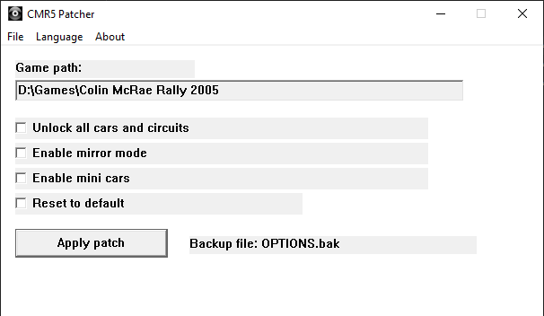

# CRM5 Patcher v1.0.0

Petit utilitaire destiné à modifier certains paramètres du jeu **Colin McRae Rally 2005** afin d’activer des fonctionnalités cachées ou pratiques.

## 📌 Fonctionnalités

- **Débloquer toutes les voitures et circuits**  
  Accès immédiat à tout le contenu du jeu sans progression.

- **Activer le mode miroir**  
  Inverse les circuits pour une expérience de conduite différente.

- **Activer le mode mini voitures**  
  Transforme les véhicules en versions miniatures pour un rendu fun.

- **Réinitialiser les paramètres**  
  Restaure les valeurs par défaut du jeu.

## 🖥️ Interface

L’application propose une interface simple :

- Sélection du dossier du jeu
- Cases à cocher pour chaque fonctionnalité
- Bouton pour appliquer les modifications
- Création automatique d’une sauvegarde

## 📷 Aperçu



## ⚙️ Installation

Aucune installation requise.

- Exécutable portable
- Compatible Windows uniquement
- Versions disponibles : **x86** et **x64**

## ▶️ Utilisation

1. Lancer **CRM5 Patcher**
2. Vérifier ou renseigner le chemin du jeu  
   Exemple : `D:\Games\Colin McRae Rally 2005`
3. Cocher les options souhaitées
4. Cliquer sur **Apply patch**

## 💾 Sauvegarde

Avant toute modification, le patcher crée automatiquement un fichier de sauvegarde :

```
OPTIONS.bak
```

## 🔄 Restauration

Pour revenir aux paramètres par défaut :

- Cocher **Reset to default**
- Cliquer sur **Apply patch**

## ⚠️ Avertissement

- Utiliser ce patch à vos risques
- Toujours conserver une copie de vos fichiers de sauvegarde
- Compatible uniquement avec **Colin McRae Rally 2005**

## 📜 Licence

Ce projet est sous licence **MIT**.

Vous êtes libre de :
- Utiliser
- Modifier
- Distribuer

Sous réserve d’inclure la licence originale.

## 📦 Version

**v1.0.0**
